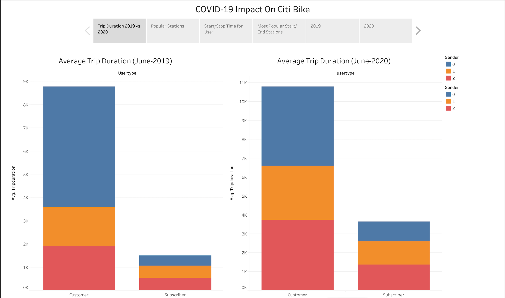
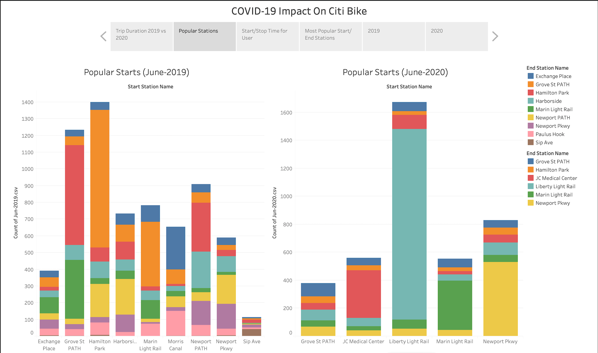
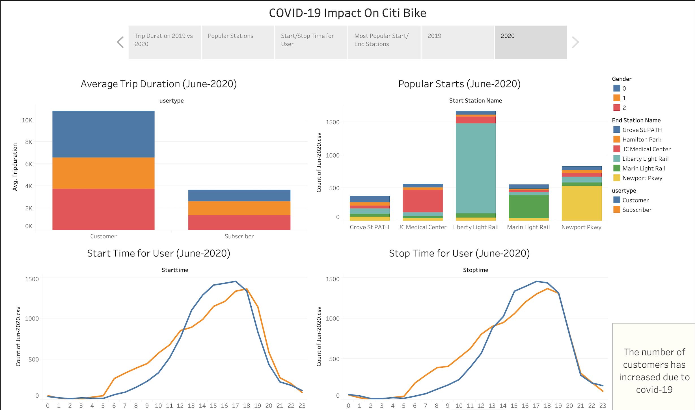

# Tableau - Citi Bike Analytics

# Data Source
Monthly CSV files (June 2019- June 2020) were collected from Citi Bike Data webpage.

# Visualizations
https://public.tableau.com/app/profile/sonny5205/viz/Tableauchallenge_16165983401890/Story1

# Analysis
1. Trip Duration 2019 vs 2020

Total number of customers and subscribers increased during the month of June 2020 due to COVID-19 impact. 

2. Popular Stations

Some of the most popular stations during 2019 have been closed due to COVID-19 so as a result some of the less popular stations got busy in 2020. 

3. Start/Stop Time for Users

Most of users have been the usual subscribers and have been using Citi Bike mostly before and after work for transportation during 2019. In 2020 more customers have been using Citi Bike mostly in the evening due to COVID-19 imapct and not having to have a commute to work in the morning and working remotley.

4. Most popular Start/Stop Stations

Stations are more spread out in 2020 due to some restrictions and population control as a result of COVID-19. 

5. COVID-19 Impact on Citi-Bike During 2019

6. COVID-19 Impact on Citi-Bike During 2020

